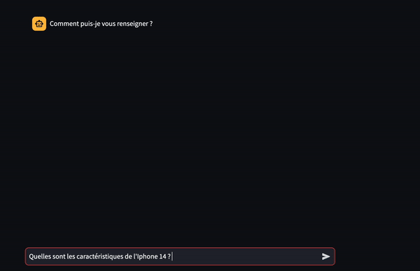

# LLMs

This repository contains LLMs use cases and studies

# Prerequisites

- Create a virtual environnement:
    - `python3.10 -m venv .venv`
    - `source .venv/bin/activate`
    - `pip install -r requirements.txt`

- Copy the env.template and fill your environment variables
     - `cp .env.template .env`

# Use cases

## I. Smartphone advisor

 **Smartphone advisor** is a LLM Chain Chat Bot that answer technical questions about tech products.

 It uses a Chroma vector store from Youtube video extracted texts.

 It follows the [course](https://learn.deeplearning.ai/langchain-chat-with-your-data/) by Andrew NG and Harrison Chase, Langchain CEO.

[Code here](./use_cases/smartphone_advisor/)

[Documentation here](./use_cases/smartphone_advisor/README.md)

You will learn with this use case the following concepts:
- **Character Text Splitter vs Recursive Character Text Splitter**
- **Maximum Marginal Relevance vs Semantic Search**
- **Chroma DB vs MyScale**
- **Contextual Compression & Self Query Retriever**
- **Stuff, Refine, Map Reduce & Map Rerank chain types**
- **Retrieval QA Chain vs Conversational Retrieval Chain**

