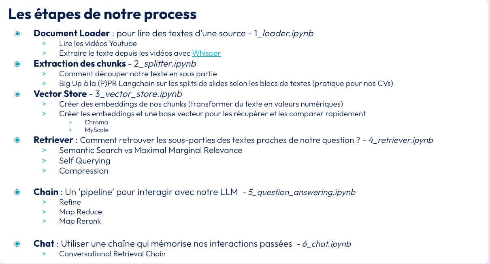

# I. Smartphone advisor

## How it works ?
 Smartphone advisor is a LLM Chain Chat Bot that answer technical questions about tech products.

 It uses a Chroma vector store from Youtube video extracted texts.
 It works as RAG mode with the following configuration:
 - Whisper (STT)
 - Recursive CHaracter Text Splitter (Chunks)
 - Chroma (Vector DB)
 - OpenAI Embedding
 - GPT 3 LLM model
 - Custom Prompt Template with history and context
 - Conversational Retrieval Chain

It can be used:
- linearly following the notebooks to understand the stucture
- directly using the streamlit app with the chosen configuration

[Link on presentation]('https://docs.google.com/presentation/d/1nF5wWPGS2mvKOSSitwk36q2iYOBM4TGMi6HczjATsCc/edit?usp=drive_link")

## Streamlit Chatbot example

## Notebook process details

## How to use ?

### Notebooks:

- `python3.10 -m venv .venv`
- `source .venv/bin/activate`
- `pip install -r requirements.txt`
- `cp .env.template .env`
- `jupyter lab`

### Streamlit:

- `streamlit run 7_streamlit_app.py`

### Knwoledges
You will learn with this use case the following concepts:
- **Character Text Splitter vs Recursive Character Text Splitter**
- **Maximum Marginal Relevance vs Semantic Search**
- **Chroma DB vs MyScale**
- **Contextual Compression & Self Query Retriever**
- **Stuff, Refine, Map Reduce & Map Rerank chain types**
- **Retrieval QA Chain vs Conversational Retrieval Chain**